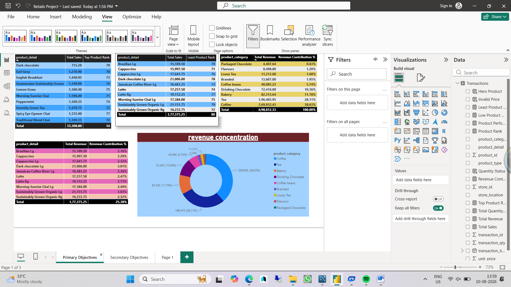

 Coffee Shop Sales Analysis – Power BI

 Project Overview

This project analyzes coffee shop transaction data using Power BI
to identify revenue trends, product performance, category
performance, store performance, and sales patterns.

 Business Objectives

- Identify top-selling products
- Identify least-selling products
- Calculate revenue by product
- Calculate revenue by product type
- Calculate revenue by product category
- Identify high-impact hero products
- Highlight low-performing products
- Analyze peak sales hours
- Compare store performance
- Support menu optimization

 Tools Used

- Power BI
- DAX
- Power Query
- Excel

 Data Cleaning & Validation

- Validated product identifiers
- Checked missing values
- Validated unit prices
- Checked transaction quantities
- Verified data types

 Revenue Calculation

Revenue = Transaction Quantity × Unit Price

 Key Analysis

 Product Performance
Identified top-selling and least-selling products based on revenue
and quantity sold.

 Revenue Contribution
Measured revenue contribution by product, product type,
and product category.

 Hero Products
Identified high-impact products contributing significantly
to overall revenue.

 Low-Performing Products
Highlighted products requiring review, redesign, or menu optimization.

 Store Performance
Compared revenue performance across store locations.

 Sales Trends
Analyzed sales by hour to identify peak sales periods.

 Dashboard

 Files

- `Retails Project.pbix` – Power BI project file
- `dashboard.png` – Dashboard screenshot
- `Dataset Description.docx` – Dataset documentation

 Key Business Insights

The analysis helps management understand which products
drive revenue, which products underperform, and where
menu optimization opportunities exist.
